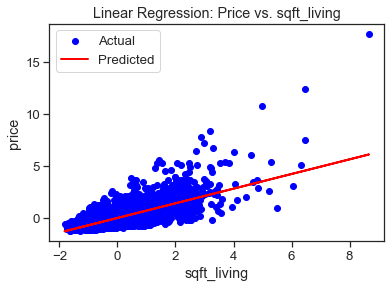
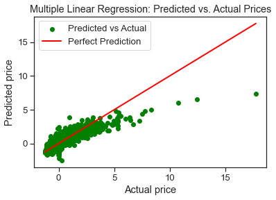

## KING COUNTY HOUSE SALES ANALYSIS
STUDENT NAMES:
1. MICHEAL ARITA
2. MERCY SILALI
3. WAFULA SIMIYU
4. JEFFREY KANYI

#### INTRODUCTION
Housing is a major issue that seems to increase with the ever growing population. People not only search for secure but comfortable housing with various factors to consider to ensure proper living. However, prices in the housing sector fluctuate over time, being influenced by various factors such as size, location, number of bedrooms, year of renovation, grade, and number of floors, just to mention a few. Having  the ability to predict the prices of houses basing on various factors can be vital to real estate agencies and other stakeholders in the real estate industry.

#### PROBLEM STATEMENT
House prices are influenced by multiple factors, making it challenging to predict prices accurately.
Accurate predictions can assist in better pricing strategies and investment decisions.

#### OBJECTIVES
1. To explore and understant the King County House Sales dataset's structure and content.
2. To perform data cleaning and data wrangling to prepare the dataset for analysis.
3. To perform exploratory data analysis to understand the data and identify patterns and trends.
4. To build a regression model to predict the house prices based on the different factors.
5. To investigate the relationship between house prices and the different factors such as the size of the house among others
6. Price Prediction: Create a model that can accurately forecast the prices of houses based on features such as year built, the size of the house among other features.

#### METHODOLOGY
1. Business understanding
2. Data understanding
3. Data preparation
4. Data modelling
5. Evaluation
6. Model interpretation and Recommendations.

#### DATA UNDERSTANDING
The dataset contains information about houses sold in King County between the years 2014 and 2015. The dataset is 'kc_house_data.csv'
The column names are further detail in 'column_names.md' dataset.
The dataset contains 21597 rows and 21 columns. The dataset contains the following columns:
1. id: Unique ID for each house.
2. date: Date the house was sold.
3. price: Price of the house in USD.
4. bedrooms: Number of bedrooms in the house.
5. bathrooms: Number of bathrooms in the house.
6. sqft_living: Square footage of the house's living area.
7. sqft_lot: Square footage of the house's lot area.
8. floors: Number of floors in the house.
9. waterfront: Whether the house has a waterfront view (1 = yes, 0 = no
10. view: The view from the house (1 = good, 0 = bad).
11. condition: The condition of the house (1 = excellent, 0 = poor).
12. grade: The grade of the house (1 = excellent, 0 = poor).
13. sqft_above: Square footage of the house's living area above ground level.
14. sqft_basement: Square footage of the house's basement area.
15. yr_built: Year the house was built.
16. yr_renovated: Year the house was renovated.
17. zipcode: Zip code of the house.
18. lat: Latitude of the house.
19. long: Longitude of the house.
20. sqft_living15: Square footage of the house's living area in 2015
21. sqft_lot15: Square footage of the house's lot area in 2015.

The analysis performed on the dataset included the following steps:

1. Data preparation: The data was cleaned and pre-processed to remove any missing values, outliers
2. Exploratory Data Analysis (EDA)
3. Pre-processing where feature engineering was performed and the data was transformed to create new features that could be used to improve the model's performance.
4. By performing these steps, we aimed to gain a comprehensive understanding of the dataset and prepare it for further analysis and modeling

### MODELLING.
1. Simple Linear Regression
The simple linear regression below is to show the relationship between the 'price' and the 'sqft_living' of the houses.
The 'price' is the dependent variable(target variable) and the 'sqft_living' is the independent variable(feature).
The model is trained using the 'train' data and the model is tested using the 'test' data. The model is then used to predict the 'price' of the houses in the 'test' data

The model has a coefficient of determination (R^2) of 0.49, which means that the model explains 49% of the variation in the 'price' of the houses. This means that the model is not very accurate and can only be used to make predictions with a certain level of uncertainty.

2. Multiple Linear Regression
The multiple linear regression below is to show the relationship between the 'price' and the 'sqft_living', 'sqft_lot', 'bedrooms', 'bathrooms', 'floors'
The 'price' is the dependent variable(target variable) and the other variables are the independent variables(features)
The model is trained using the 'train' data and the model is tested using the 'test'. The model is then used to predict the 'price' of the houses in the 'test' data

This model had an improve R squared of 0.73, which translates to 73%.

#### RECOMMENDATIONS
1. Collect more detailed data on house features like interior renovations and  landscaping to enhance the model's ability to capture the true value of unique house characteristics
2. Collect more detailed data on neighborhood features like crime rates, school quality, and  amenities.
3. Integrate economic factors such as interest rates, employment rates, and income levels since they significantly impact housing markets, and their inclusion can improve model accuracy
4. Ensure the model uses the most recent data available by regularly updating the. Dataset which will help the model remain relevant and accurate in a dynamic housing market
5. Incorporate data from surrounding areas and regions to capture a broader market perspective which can help the model account for regional price differences and market trends.
6. Regular testing and validation help identify weaknesses and areas for improvement, ensuring the model's reliability.

